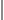

## Making life easier through code

I like building things that make someone's day a little easier.

I work mainly with **TypeScript** (React, Next.js, NestJS), and **Dart** (Flutter).

Learning **Golang** and daily driving Fedora Linux and Gnome.

  
  &nbsp;&nbsp;
  

  
  
  
  
  
  
  
  
  
  
  
  

